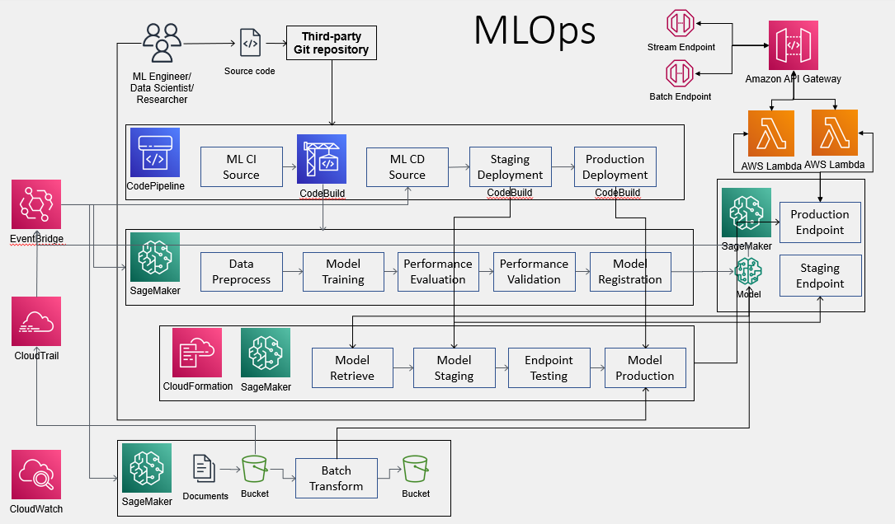

# Documentation


Author: [Yang Lin](https://yanglin1997.github.io/)

E-mail: linyang1997@yahoo.com.au

Considering an enterprise machine learning system, the MLOps on AWS Sagemaker is developed. 

Highlishts of the design:
- Use of IaC for end-to-end code CICD build, pipelines build and model deployment.
- Re-package of model as container for Asynchronous and Synchronous inference.
- Versioning and monitoring code, pipeline and model.
- Enable data capture for the real-time endpoint

The Architecture diagram:

Response to the requirement:

1. the Architecture diagram:
<!--  -->
<div style="text-align:center"></div>

2. linear regression model
Vectorization is applied for both gradient descent and prediction.
time and memory complexity
Final result gives a R2 score of 0.47.

3. an API for inference
The Cloudformation is employed to deploy the lastes approved model. The 'staging' model is deployed first and once its approved manually, the same model would be deployed on better computational resource for 'production'. Please see 'https://github.com/YangLIN1997/model-deploy' repository. 

- `POST /stream` : it can be invoked with 'https://lbe1si5il9.execute-api.ap-southeast-2.amazonaws.com/production/stream'. It takes single record e.g. json.dumps({"x": [[0.3]]}), and returns a prediction, e.g. 434.08.
- `POST /batch` : it can be invoked with 'https://lbe1si5il9.execute-api.ap-southeast-2.amazonaws.com/production/batch'. It takes multiple records e.g. json.dumps({"x": [[0.3],[0.3]]}), and returns a prediction, e.g.  [[434.0765649977469], [434.0765649977469]]. 
For both API, the key ("x-api-key") is "YangLinYangLinYangLin".

For the use case study, the python script tests both endpoints.

Additionally, a batch inference that cable to make prediction for a batch of files peoridically is also necessary. Hence a batch transform pipeline is build with lates approved model and cable to make predictions. 

4. package code into a python package
Yes, the 'train.py' is packaged. Also the 'dill' package is used to package trained model with object information. 

5. package code into a container
Yes, all steps in the pipeline are containerized.

6. CICD
Yes.

7. componenets for an enterprise machine learning system
Except for the highlights listed at the beginning, the system still: 
Critical to have: monitoring system
Nice to have: 

8. end to end
Yes.

9. unit tests or integration tests
Yes. For the endpoint deployment, test is employed on the 'staging' endpoint to check if it is in service, has data capture enbaled and able to be invoked. 

10. security/monitoring
Yes, even API endpoint requires the API key and the post usage is also limited.

11. document
Yes. 

12. service
From the code perspective, it is well packaged and documented.
From the scalability perspective, it is developed on the Sagemaker plantform with versioning and monitoring ability and is good for multiple DS/MLE to work together. The training and deployment can also be scaled up with more instance and data parallel for training and auto-scaling policy for endpoints.

13. production ML system


## Layout of the SageMaker ModelBuild Project

This is the code repository as part of a Project in SageMaker as the CI part of the MLOps. 

```
|-- codebuild-buildspec.yml
|-- CONTRIBUTING.md
|-- pipelines
|   |-- LR
|   |   |-- __init__.py
|   |   |-- train.py
|   |   |-- evaluate.py
|   |   |-- inference.py
|   |   |-- pipeline.py
|   |   |-- pipeline_batch.py
|   |   `-- preprocess.py
|   |-- get_pipeline_definition.py
|   |-- __init__.py
|   |-- run_pipeline.py
|   |-- _utils.py
|   `-- __version__.py
|-- README.md
|-- setup.cfg
|-- setup.py
|-- tests
|   `-- test_pipelines.py
`-- tox.ini
```

## Start here

The following section provides an overview of how the code is organized and what you need to modify. In particular, `pipelines/pipelines.py` contains the core of the business logic for this problem. It has the code to express the ML steps involved in generating an ML model. You will also find the code for that supports preprocessing, training and evaluation steps in `preprocess.py` , `train.py` and `evaluate.py` files respectively. Additionally, we pack `inference.py` with pre-trained model data as a container to register it as a model on Sagemaker for inference, `pipelines/pipelines_batch.py` defines the batch inference pipeline.

A description of some of the artifacts is provided below:
<br/><br/>
The codebuild execution instructions. 

```
|-- codebuild-buildspec.yml
```

<br/><br/>
The pipeline artifacts, which includes a pipeline module defining the required `get_pipeline` method that returns an instance of a SageMaker pipeline, a preprocessing script that is used in feature engineering, and a model evaluation script to measure the Mean Squared Error of the model that's trained by the pipeline. Note that the 'pipeline_batch.py' creates the batch inference pipeline that transforms the csv files in "s3://sagemaker-project-p-unfbxwxpd29d/batchdata/input/" and save the outputs at "s3://sagemaker-project-p-unfbxwxpd29d/batchdata/output/".

```
|-- pipelines
|   |-- LR
|   |   |-- __init__.py
|   |   |-- pipeline.py
|   |   |-- pipeline_batch.py
|   |   ```

```
<br/><br/>
Utility modules for getting pipeline definition jsons and running pipelines (you do not typically need to modify these):

```
|-- pipelines
|   |-- get_pipeline_definition.py
|   |-- __init__.py
|   |-- run_pipeline.py
|   |-- _utils.py
|   `-- __version__.py
```
<br/><br/>
Python package artifacts:
```
|-- setup.cfg
|-- setup.py
```
<br/><br/>
A stubbed testing module for testing your pipeline as you develop:
```
|-- tests
|   `-- test_pipelines.py
```
<br/><br/>
The `tox` testing framework configuration:
```
`-- tox.ini
```
